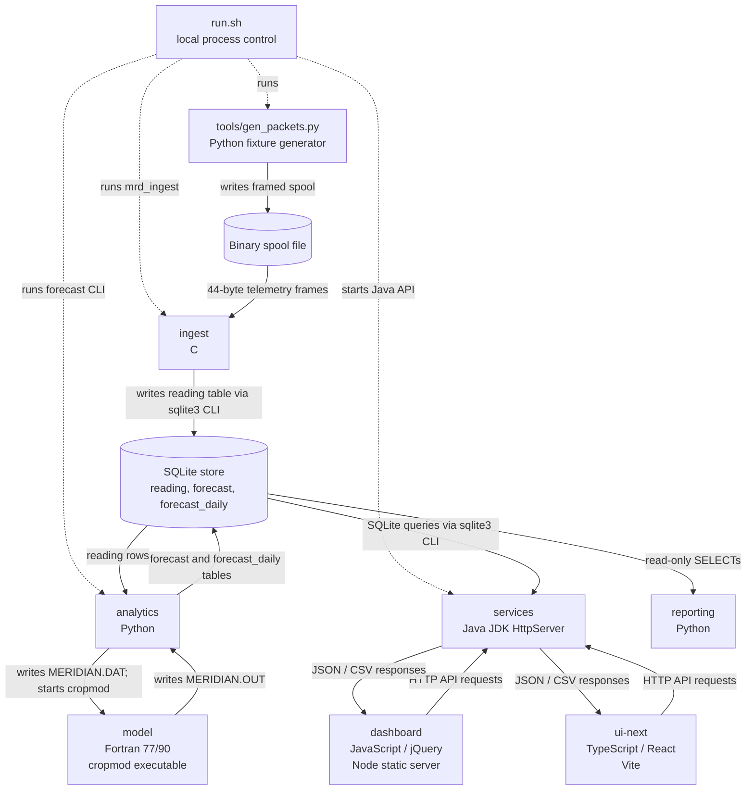

# Meridian Architecture (Code-Derived)

The code describes **seven subsystems**, not the three-part system in the root README. Solid arrows below show data or requests; dashed arrows show launch/control flow. `run.sh` is a local integration script, not an eighth subsystem.

## Responsibilities and Interfaces

| Subsystem | Responsibility | Exposed interface |
|---|---|---|
| `ingest` | Reads framed telemetry from a spool, decodes and quality-checks it, then stores readings. | C command-line program: `mrd_ingest <spoolfile> <store.db>`; SQLite `reading` table. See [ingest entry point](../ingest/src/mrd_ingest.c) and [store writer](../ingest/src/tsstore.c). |
| `model` | Computes daily crop, water-balance, and yield outputs for one input deck. | Fortran executable `cropmod`; fixed-name `MERIDIAN.DAT` input and `MERIDIAN.OUT` output. See [model driver](../model/cropmod.f). |
| `analytics` | Reads weather records, builds model decks, runs the model, parses results, and stores forecasts. | Python CLI [`analytics/run_forecast.py`](../analytics/run_forecast.py) and callable `run_all` / `run_station_year`; file contract with the model. See [orchestrator](../analytics/meridian/orchestrator.py). |
| `services` | Serves store-backed data to clients over HTTP. | Java `ApiServer` on port 8081; routes include `/api/health`, `/api/stations`, `/api/forecast`, `/api/series`, `/api/summary`, `/api/anomalies`, `/api/export`, and `/api/metrics`. See [API server](../services/src/ca/meridian/api/ApiServer.java). |
| `dashboard` | Serves the legacy operator console's static assets; its browser code calls the API. | Node static server, normally on port 8080, plus browser-side JavaScript API client. See [static server](../dashboard/server.js) and [client](../dashboard/js/api.js). |
| `ui-next` | Provides the React/TypeScript console rewrite; it is a separate client, not a replacement backend. | Vite app and typed fetch client calling the Java HTTP API. See [API client](../ui-next/src/api/client.ts) and [migration status](../ui-next/MIGRATION.md). |
| `reporting` | Produces formatted reports from the shared store without modifying it. | Python CLI (`python -m reporting ...`) and importable `run_report`; read-only SQLite access. See [report CLI](../reporting/reporting/cli.py) and [database accessor](../reporting/reporting/db.py). |

## Documentation Claims Contradicted by Code

The root [README](../README.md) says it was last updated in 2015. Its architecture and setup claims do not match the checked-in code:

- **"Three-tier application" consisting of collector, application server, and web client:** that is an incomplete snapshot. The code has the seven subsystems above, including a Fortran model, Python analytics pipeline, a second UI, and standalone reporting.
- **Collector "receives telemetry from the field station network":** the current C entry point accepts a **spool-file path** and a database path. The local launcher generates a synthetic spool and passes it to ingest; the checked-in ingest path is file-based, not a network receiver. See [run.sh](../run.sh) and [ingest entry point](../ingest/src/mrd_ingest.c).
- **"Spring Boot" server with "scheduled batch jobs":** the service is wired with the JDK's `HttpServer`. The forecast batch is a separate Python command; `run.sh` invokes it, and there is no Quartz configuration in the service tree. See [API server](../services/src/ca/meridian/api/ApiServer.java), [service build script](../services/build.sh), and [launcher](../run.sh).
- **PostgreSQL at `db01.meridian.internal`:** the implemented store is SQLite. Ingest, analytics, and the Java service use a local `.db` path; C and Java invoke the `sqlite3` command-line program, while Python uses SQLite libraries. See [SQLite writer](../ingest/src/tsstore.c), [analytics store](../analytics/meridian/store.py), and [Java DB access](../services/src/ca/meridian/db/Db.java).
- **`./gradlew build` and PostgreSQL client-library prerequisites:** there is no Gradle wrapper or Gradle build file. The root [Makefile](../Makefile) delegates to component builds; the service build uses `javac`, and the model and ingest have their own Makefiles.

Two other docs also contradict the source:

- [CONTRACTS.md](CONTRACTS.md) documents forecast/series query parameter `stn` and says all API responses are JSON. The handlers read `station`, and `/api/export` returns CSV. See [forecast handler](../services/src/ca/meridian/api/ForecastHandler.java), [series handler](../services/src/ca/meridian/api/SeriesHandler.java), and [export handler](../services/src/ca/meridian/api/ExportHandler.java).
- [ui-next/MIGRATION.md](../ui-next/MIGRATION.md) says the Java service never grew `/api/anomalies`. It is registered in [ApiServer](../services/src/ca/meridian/api/ApiServer.java) and implemented by [AnomaliesHandler](../services/src/ca/meridian/api/AnomaliesHandler.java). That endpoint existing does not mean the corresponding UI screen is complete; it means the migration doc's explanation for the stub is stale.
