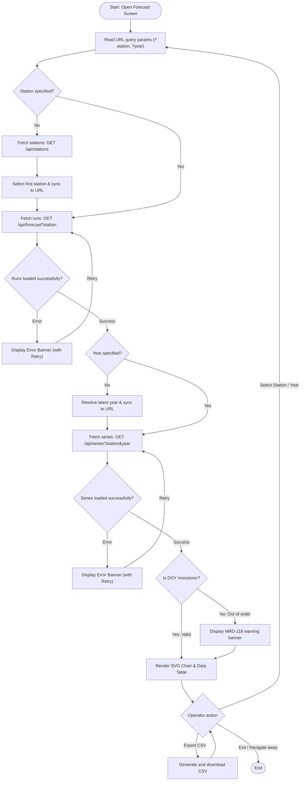

# ui-next: Main Workflow UML Activity Diagram

```mermaid
flowchart TD
    Start([Start: Open Forecast Screen]) --> ParseURL["Read URL query params (?station, ?year)"]
    
    ParseURL --> HasStation{"Station specified?"}
    HasStation -->|No| FetchStations["Fetch stations: GET /api/stations"]
    FetchStations --> SetDefaultStation["Select first station & sync to URL"]
    SetDefaultStation --> FetchForecast["Fetch runs: GET /api/forecast?station"]
    HasStation -->|Yes| FetchForecast

    FetchForecast --> CheckForecastAPI{"Runs loaded successfully?"}
    CheckForecastAPI -->|Error| ShowErrorRuns["Display Error Banner (with Retry)"]
    ShowErrorRuns -->|Retry| FetchForecast
    
    CheckForecastAPI -->|Success| HasYear{"Year specified?"}
    HasYear -->|No| ResolveLatestYear["Resolve latest year & sync to URL"]
    ResolveLatestYear --> FetchSeries["Fetch series: GET /api/series?station&year"]
    HasYear -->|Yes| FetchSeries

    FetchSeries --> CheckSeriesAPI{"Series loaded successfully?"}
    CheckSeriesAPI -->|Error| ShowErrorSeries["Display Error Banner (with Retry)"]
    ShowErrorSeries -->|Retry| FetchSeries

    CheckSeriesAPI -->|Success| CheckDOY{"Is DOY monotonic?"}
    CheckDOY -->|No: Out of order| ShowWarning["Display MRD-118 warning banner"]
    CheckDOY -->|Yes: Valid| RenderChart["Render SVG Chart & Data Table"]
    ShowWarning --> RenderChart

    RenderChart --> UserAction{"Operator action"}
    UserAction -->|Select Station / Year| ParseURL
    UserAction -->|Export CSV| DownloadCSV["Generate and download CSV"]
    DownloadCSV --> UserAction
    UserAction -->|Exit / Navigate away| End([End])
```
