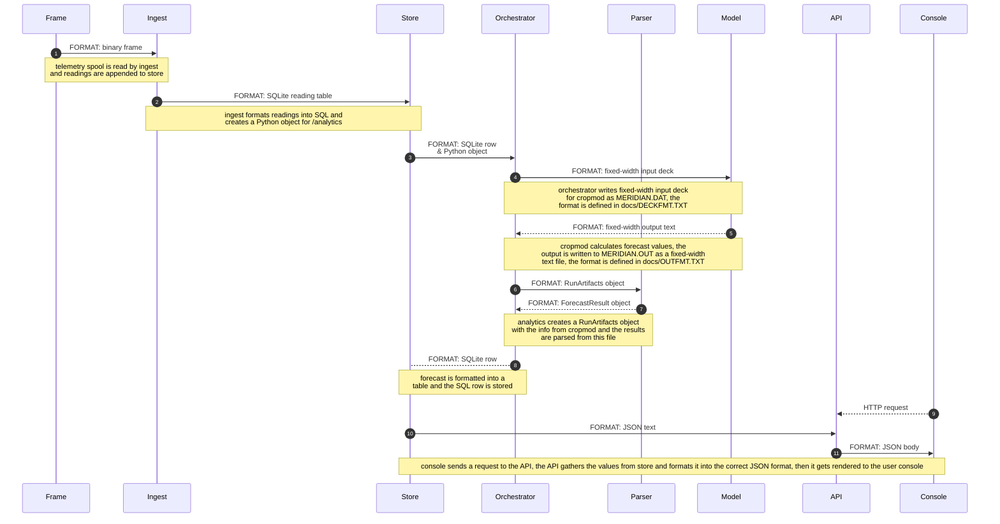

# End-to-End Trace Sequence Diagram

```mermaid
sequenceDiagram
    autonumber
    participant FR as Frame
    participant IN as Ingest
    participant ST as Store
    participant OR as Orchestrator
    participant PA as Parser
    participant MO as Model
    participant API
    participant CO as Console

    FR->>IN: FORMAT: binary frame
    Note over FR,IN: telemetry spool is read by ingest<br>and readings are appended to store
    IN->>ST: FORMAT: SQLite reading table
    Note over IN,ST: ingest formats readings into SQL and<br>creates a Python object for /analytics
    ST->>OR: FORMAT: SQLite row<br>& Python object

    OR->>MO: FORMAT: fixed-width input deck
    Note over OR,MO: orchestrator writes fixed-width input deck<br>for cropmod as MERIDIAN.DAT, the<br>format is defined in docs/DECKFMT.TXT
    MO-->>OR: FORMAT: fixed-width output text
    Note over MO,OR: cropmod calculates forecast values, the<br>output is written to MERIDIAN.OUT as a fixed-width<br>text file, the format is defined in docs/OUTFMT.TXT
    OR->>PA: FORMAT: RunArtifacts object
    PA-->>OR: FORMAT: ForecastResult object
    Note over OR,PA: analytics creates a RunArtifacts object<br>with the info from cropmod and the results<br>are parsed from this file
    OR-->ST: FORMAT: SQLite row
    Note over ST,OR: forecast is formatted into a<br>table and the SQL row is stored

    
    CO-->>API: HTTP request
    ST->>API: FORMAT: JSON text
    API->>CO: FORMAT: JSON body
    Note over CO,ST: console sends a request to the API, the API gathers the values from store and formats it into the correct JSON format, then it gets rendered to the user console
```