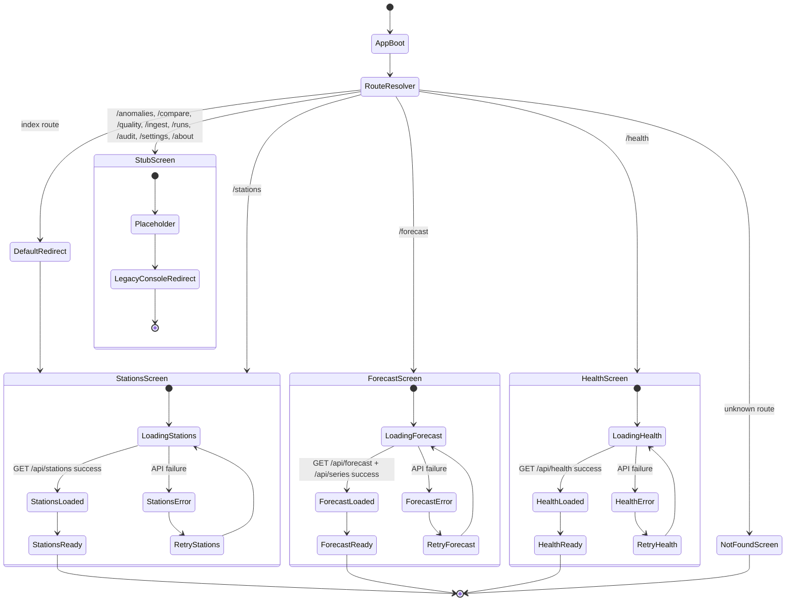

```mermaid
stateDiagram-v2
    [*] --> AppBoot

    AppBoot --> RouteResolver
    RouteResolver --> DefaultRedirect: index route
    DefaultRedirect --> StationsScreen

    RouteResolver --> StationsScreen: /stations
    RouteResolver --> ForecastScreen: /forecast
    RouteResolver --> HealthScreen: /health
    RouteResolver --> StubScreen: /anomalies, /compare, /quality, /ingest, /runs, /audit, /settings, /about
    RouteResolver --> NotFoundScreen: unknown route

    state StationsScreen {
        [*] --> LoadingStations
        LoadingStations --> StationsLoaded: GET /api/stations success
        LoadingStations --> StationsError: API failure
        StationsLoaded --> StationsReady
        StationsError --> RetryStations
        RetryStations --> LoadingStations
    }

    state ForecastScreen {
        [*] --> LoadingForecast
        LoadingForecast --> ForecastLoaded: GET /api/forecast + /api/series success
        LoadingForecast --> ForecastError: API failure
        ForecastLoaded --> ForecastReady
        ForecastError --> RetryForecast
        RetryForecast --> LoadingForecast
    }

    state HealthScreen {
        [*] --> LoadingHealth
        LoadingHealth --> HealthLoaded: GET /api/health success
        LoadingHealth --> HealthError: API failure
        HealthLoaded --> HealthReady
        HealthError --> RetryHealth
        RetryHealth --> LoadingHealth
    }

    state StubScreen {
        [*] --> Placeholder
        Placeholder --> LegacyConsoleRedirect
        LegacyConsoleRedirect --> [*]
    }

    StationsReady --> [*]
    ForecastReady --> [*]
    HealthReady --> [*]
    NotFoundScreen --> [*]
```
